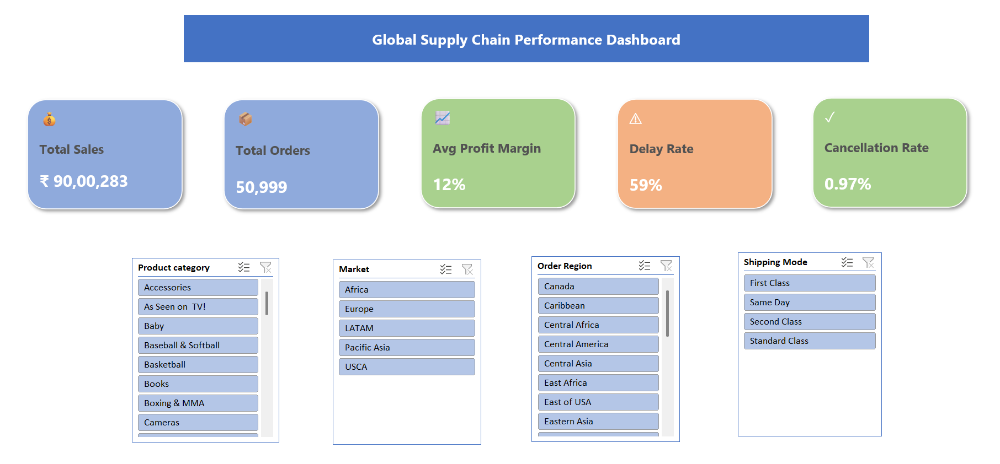
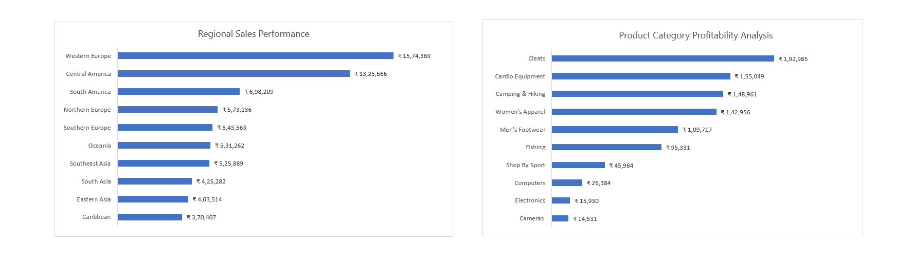
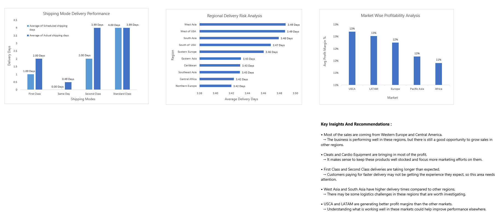

# supply-chain-performance-intelligence-dashboard

Interactive Excel dashboard analyzing sales, profitability, and delivery performance to generate actionable supply chain insights.

## Project Overview

This project analyzes historical supply chain order data to understand sales performance, profitability, and delivery efficiency. An interactive Excel dashboard was developed to transform raw data into meaningful insights that support business decision-making.

## Business Problem

The business had large amounts of order data, but it was not easy to track sales performance, profitability, and delivery efficiency in one place. This project brought all the important metrics together to help identify opportunities and areas needing improvement.

## Project Objective

To analyze supply chain performance across regions, products, markets, and shipping modes using historical order data and develop an interactive dashboard that provides insights into sales, profitability, and delivery performance.

## Tools & Techniques Used

- Microsoft Excel
- Data Cleaning
- Data Validation
- Pivot Tables
- Pivot Charts
- Slicers
- Calculated Metrics
- Conditional Formatting
- Dashboard Design

## Key Performance Indicators (KPIs)

- Total Sales
- Total Orders
- Average Profit Margin (%)
- Delay Rate (%)
- Cancellation Rate (%)

**Note: **Additional KPIs were calculated during analysis; key executive KPIs were selected for dashboard reporting.

## Analysis Performed

- Regional Sales Performance Analysis
- Product Category Profitability Analysis
- Shipping Mode Delivery Performance Analysis
- Regional Delivery Risk Analysis
- Market-wise Profitability Analysis

## Recommendations

- Investigate the causes of delivery delays in high-risk regions.
- Review shipping modes associated with lower delivery performance.
- Focus on expanding high-profit product categories.
- Develop region-specific strategies to improve operational efficiency.
- Continuously monitor key supply chain metrics to support data-driven decisions.

## Project Deliverables

- Interactive Excel Dashboard
- KPI Planning and Calculation Sheets
- Pivot-based Analytical Reports
- Data Dictionary
- Project Documentation
- Dashboard Screenshots

## Dashboard Preview

### Executive Overview

### Business Performance Analysis

### Operational Performance Analysis

